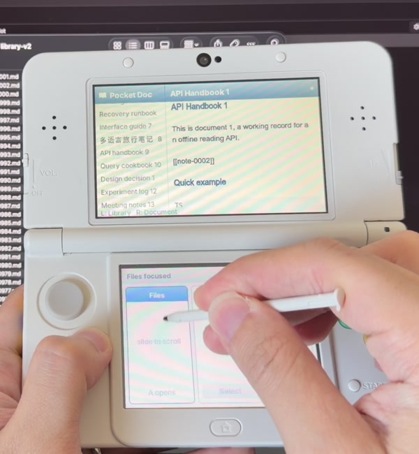
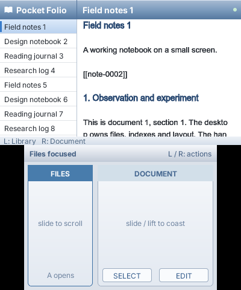
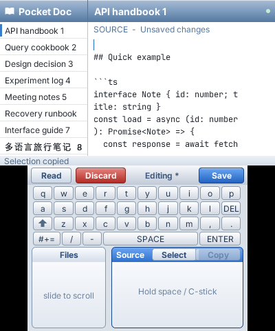
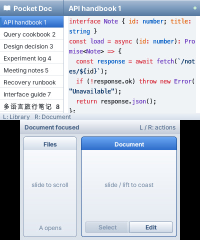
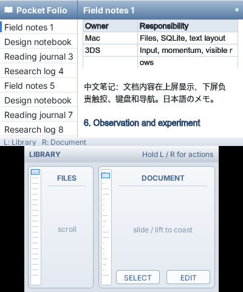
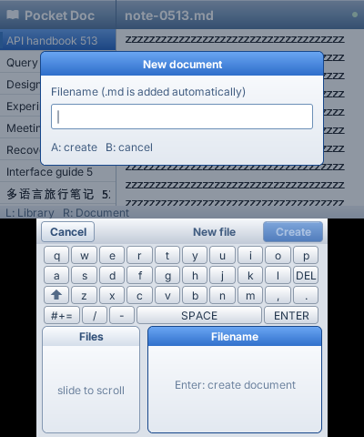
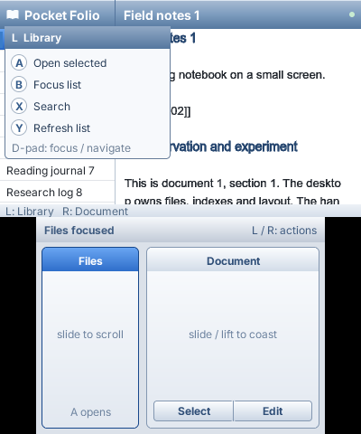
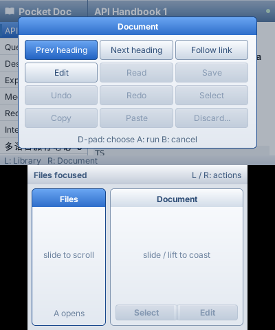

# Pocket Doc

A Markdown library and source editor for the Nintendo 3DS, backed by a paired
Mac. The Mac owns files, SQLite full-text search and text layout. The 3DS owns
the two-screen interface, scrolling momentum, selection and a bounded editing window.
The Mac retains the full unsaved draft in SQLite; only Save replaces the Markdown file.

The generated test library contains **1,000 files**, from **114,690 bytes** to
**1,049,446 bytes**, totalling **157,277,771 bytes**. Eight original synthetic
scenarios cover API handbooks, SQL cookbooks, design decisions, experiments,
meetings, recovery runbooks, interface guides and multilingual journals. Ten
files are approximately 1 MiB. `bun run seed` deterministically generates them
under the ignored `data/library-v2/` directory and never overwrites existing
files. The earlier `data/library/` fixture can remain beside it. Only bounded
pages and visible rows cross the network.

## Screenshots

Pocket Doc running on a real Nintendo 3DS, connected to a Mac over Wi-Fi:



These simulator captures run the compiled application with the PocketJS Wasm
renderer. Each image shows the upper screen above the lower touch screen.

| Browse the library | Edit Markdown | Read highlighted code |
| --- | --- | --- |
|  |  |  |

| Tables | New document | File commands |
| --- | --- | --- |
|  |  |  |

See [shared resource ownership](docs/RESOURCES.md) and
[validation receipts](docs/VALIDATION.md) for architecture, capture provenance and checks.

## Run

Use the 3DS build prerequisites described by the pinned runtime's
`hosts/3ds/README.md` (Rust toolchain, QuickJS sources and devkitARM container).

```sh
git clone --recursive https://github.com/pocket-stack/pocket-doc.git
cd pocket-doc
bun install --cwd runtime --frozen-lockfile
bun scripts/setup.ts
bun run seed
bun run 3ds
# With ftpd open on the selected 3DS:
bun scripts/deploy.ts <3ds-ip>
bun run host <3ds-ip>
```

Exit ftpd and launch Pocket Doc from HBL. `scripts/deploy.ts` transfers the
app-specific pairing key and `.3dsx`, then reads both back byte-for-byte. Keys,
generated documents, SQLite, build products and logs are ignored by Git.

## Controls

| State | Controls |
| --- | --- |
| Both panes | Left/right chooses focus; up/down navigates the focused pane |
| Library | Left touchpad/circle pad scrolls; tapping focuses Files; A opens; SELECT searches |
| Reader | Right touchpad scrolls/flings; tapping focuses Document; up/down and circle pad scroll vertically |
| Code in reader | Left/right scrolls the first visible overflowing code block horizontally |
| Editor | Hold SPACE for 350 ms, then drag to move caret; short tap inserts space; arrows and the New 3DS C-stick also move caret |
| Editor | Right pad scrolls source; the Select touch button arms selection with held-space dragging; COPY copies it |
| Editor | Top Read returns to reading and retains the draft; Save / START saves; Edit reopens it |
| Editor | Discard opens a sheet; Keep Editing / B cancels; Discard Changes / A confirms |
| Host | L+R+START returns to Homebrew Launcher |

Hold **L** for a centered file-command list: New document, Open, Search,
Refresh and Delete document. Up/down chooses an item; A runs it. Hold **R** for a
centered three-column document panel: Previous heading, Next heading, Follow link;
Edit, Read, Save; Undo, Redo, Select; Copy, Paste, Discard. All four
directions navigate this grid. Unavailable commands are dimmed. B cancels;
releasing the shoulder closes the panel. After confirmation, the same held
shoulder must be released before its panel can open again. Menu navigation
leaves pane focus, scrolling and source text unchanged. ZL/ZR have no app commands.

New document opens a separate filename dialog. Enter a name and press A, Enter
or Create; `.md` is added automatically. The Mac creates the file without
replacing an existing name, and the 3DS selects it and enters source editing.

Delete document acts on the selected file in the left pane. A confirmation
sheet names its filename; Cancel/B keeps it and Delete Document/A confirms.
Save or discard an unsaved draft first. The Mac checks the saved revision and
moves the file into `.doc/deleted/<operation>.md`, then removes its index/search
entries. The retained copy allows recovery; deleting the final result shows an
empty view. Refresh rescans the Mac directory. Clear a search by submitting an
empty query in Search files.

After touch or circle-pad scrolling leaves the selected file offscreen, the
next up/down press selects the first visible file. Further presses move normally.

The 3DS panel supports one contact. All controls work with one stylus contact;
typing and relative caret movement share the same screen without hiding the
keyboard. The active pad has a blue header, and the bottom navigation bar names the focused pane.
Editing shows persistent Read, Discard and Save controls. The space key is
140px wide; the keyboard contains no duplicate Save button. Four 22px key rows
leave 112px for each pad, including a 90px source gesture area. A shared 6px
grid sets outer margins, spacing between pads and clearance below the keyboard
or navigation bar, in both reading and editing modes. Select/Copy sit
in the Source header while editing. The upper screen uses
an iOS 6 light palette, with a persistent 128-pixel file pane and 256-pixel
document pane. File labels are 12px. Body text remains 13px, headings 14px, source 12px and document
line spacing 20px. The book logo is a packed image, independent of font glyphs.

## Classic controls and source geometry

Buttons, keycaps, panel rims and selected rows use the shared
`@pocketjs/framework/classic` palette and components. A button depresses on touch,
activates on release inside, and cancels when the contact slides outside, the
button becomes disabled or a modal blocks its gesture. Select and Copy form
adjacent toolbar actions with one shared border; Select retains the blue state
while selection is active in the editor. Read clears this state; Select is
disabled in reading mode, and Edit is the explicit entry to source mode. File selection uses the same blue gradient with
white labels. Panel fills are inset so their header cannot cover the rounded rim.

The bevels and action-sheet arrangement reference Apple's archived
[iOS 6 controls](https://developer.apple.com/library/archive/documentation/UserExperience/Conceptual/TransitionGuide/Controls.html)
and [temporary views](https://developer.apple.com/library/archive/documentation/UserExperience/Conceptual/TransitionGuide/TempViews.html).
The framework `ClassicSheet` presents the red confirmation and Keep Editing
buttons with a 4px gap and 4px clearance above the screen bottom. Its native slide/fade animations take 220ms to open and
180ms to close. Touch and hardware input remain blocked through closing.
Confirming drops the local window and deletes its staged Mac draft without
changing the Markdown file. Offline discard is sent after reconnect before
the editor can reopen.

Source geometry uses the baked font's **measured 7px advance**, rather than its
8px atlas envelope. This measurement drives caret and selection positions and
travels with source-tile requests; the Mac places and clips fallback glyphs to
the same grid, with two cells for wide characters. The editor still wraps at
30 cells. This fixes the visible caret drift that made `This is|` appear to
insert before the final `s` even though the underlying UTF-16 insertion was local.

Shift has three states: off, one uppercase character, and caps lock. Two taps
within 350ms enable caps lock, shown by a second bar below the arrow. One tap
on the locked key unlocks it. Undo and Redo keep at most 32 local window
snapshots; new input drops the redo branch. These local operations work offline.
After changing windows, undo/redo can also traverse the last 32 staged window
changes on the Mac; these operations need the connection and pause text input
until the replacement window arrives.

## Code blocks

The Mac worker uses a retained [Shiki highlighter](https://shiki.style/guide/install)
with the GitHub Light theme. Supported grammars include TypeScript, JavaScript,
JSON, Python, Bash, SQL, Rust, C/C++, CSS, HTML, YAML and diff. Backtick and tilde
fences preserve multiline grammar state; unknown languages retain a plain
monospace fallback. Tabs advance to four-cell stops. Code lines never soft wrap in the reader. They use a 7px fixed grid, with two
cells for wide characters. Left/right scrolls the first visible code block
when it exceeds the pane width. Other blocks retain their own position, with
at most sixteen saved horizontal offsets. The host returns only the requested
256px viewport; long lines never enlarge a device texture.

Coverage is unchanged at 1,024 bytes per row. Highlighted rows additionally
send 256 palette indices and at most sixteen RGB colors, within the existing
2,500-character reply limit. The framework colors the coverage in native code
using the same scratch buffer and one texture upload per frame. No grammar,
syntax tokens or HTML enter the handheld runtime.





## Ownership and bounds

The app imports PocketJS APIs from `@pocketjs/framework/*`, and Solid primitives
from `solid-js`. The runtime is a pinned submodule. Framework changes belong to
PocketJS; Markdown, file revisions, editor state and controls belong here.

The Mac lays out each document revision and rasterizes individual **256×16**
text rows with its font fallback. A row is a **1,024-byte 2-bit alpha mask**,
encoded inside a bounded offload reply. The 3DS uploads it through the framework's
native coverage decoder and retains at most **72 document resources/textures**
plus **20 small text textures** and 96 file/row metadata entries per cache.
There are twelve mounted rows per pane. Each physical slot follows its row until
it leaves the viewport; crossing one row reassigns one slot. Per-slot notifications
keep arriving resources from invalidating the whole view. Row movement uses
paint transforms. Scrolling uses
PocketJS `createScroller`, the same kinetic state machine as the Contacts demo.

Cache misses use PocketJS `ResourceBoundary` / `ResourceImage` with
application-supplied, natively animated skeleton components. **Availability is
separate from transport**: a pending image or table band substitutes its own
subtree while input, scrolling and other content continue. The outer image
view reserves its size; it borrows a texture handle from the bounded cache.
The resource model supports already-uploaded images as well as text coverage;
this app does not yet fetch Markdown image attachments. Rows beyond a known
document length are blank, and known empty lists show an empty state. They do
not render loading fallbacks or repeatedly request nonexistent rows.

At most **four app requests** are outstanding. User commands can displace
speculative reads; document start/end jumps cancel local interest in reads for the old
region. Already executing host work may finish, but stale replies do not update
the new view. The cache prefetches ahead of motion and discards distant rows.
Network delay can leave visible skeletons while momentum continues.
Editing loads up to 512 UTF-16 units into a window that can grow to 768 units.
Scrolling or moving the caret past that window stages its changes on the Mac
and loads the next region. This reaches the entire document, including its end.
Source wrapping uses the same shared cell/UTF-16 geometry on both hosts.
Ordinary typing updates the current window immediately. At the hard boundary,
a fixed queue retains up to 64 input entries while the next window arrives;
it stops accepting further input if full and displays a status message.
Whole documents, directory scans, SQLite and Markdown layout stay off the
device's JS thread.

The renderer recognizes headings, paragraphs, quotes, lists, fenced code and
pipe tables. The host sends bounded table geometry separately from text tiles.
The device draws the grid and column-shaped skeletons; wrapped cell bands keep
the original Markdown source offsets for editing. Only the first and last band
of a logical table row draw horizontal borders; wrapped lines remain inside
the same cell. Wiki links can open another indexed document. It is not a
complete CommonMark renderer or an Obsidian plugin runtime. Images, graph view,
multi-document editing and an IME are outside this version. Existing Unicode
text is rendered through Mac-generated coverage; the touch keyboard enters
Latin text and Markdown punctuation.

Keystrokes update the draft and caret locally. ASCII source lines also render
locally; changed lines containing non-ASCII text require a new Mac-rendered
texture, so their visual echo still depends on the network. The current editor
pauses text input while a save is pending.

The editor uses framework `createCaretBlink` from `@pocketjs/framework/animation`:
focus, typing and movement restart its visible phase, a held-space drag keeps it
visible, and losing focus hides it. One cancellable virtual-clock deadline
controls blinking; it adds no network dependency or per-frame UI writes.

## Saving and disconnection

Save requests include the source revision and a unique operation identity.
The provider verifies the current file hash, writes and fsyncs a temporary file,
records the operation in SQLite, atomically replaces the document, then records
completion. Startup reconciles prepared operations. Repeating the same operation
returns its previous result; reusing its identity for different content fails.

The `draft.begin/seek/save/discard` capabilities keep full unsaved source in
Mac SQLite. A seek sends the current window patch, sequence and operation ID in
one transaction, then returns a different bounded window. Its stored reply
makes a lost acknowledgement safe to retry. If typing continues before the
reply, the device keeps those newer keystrokes and stages them in a subsequent
operation. The transport itself never replays a mutation; the application
retries its explicitly idempotent draft operations.

A detected external edit produces a conflict and retains the draft. An
unacknowledged save has an unknown outcome; pressing Save again reuses its
identity. Do not open another file while a dirty draft remains. Already staged
changes survive provider restart and can be resumed; the latest unstaged
keystrokes survive network loss but not application exit or device power loss.
Offline editing can use the loaded window and its bounded input queue; other
regions show placeholders until the Mac reconnects. Selection stays within
the current window and clears when changing windows. Up to eight dirty Mac
drafts are retained, each subject to the 4 MiB document limit. Other Mac editors do not participate in the save protocol;
the hash check detects changes before replacement but cannot lock out an
uncooperative writer racing the rename.

Delete requests also carry a revision and stable operation identity. A SQLite
journal records the intent before moving the file. Recovery finishes either
side of the rename without deleting a newly recreated filename. File IDs
increase monotonically, including after the highest ID is deleted, so old
requests cannot accidentally target a newly created document.

The granted library is a flat directory of Markdown files, up to 4 MiB each.
Requests use database IDs, not device-supplied paths. The LAN transport is paired
but unencrypted; use it on the trusted local network.

## Check

```sh
bun run check
bun runtime/node_modules/typescript/bin/tsc --noEmit
bun run 3ds --pocket-only
bun runtime/tools/wasm.ts
bun scripts/sim.ts
bun scripts/scroll-replay.ts
# Install the QuickJS CLI once with: brew install quickjs
qjs --std --stack-size 131072 scripts/quickjs-smoke.js
```

The simulator writes images and behavioral/caching evidence under `dist/qa`.
It copies the generated corpus into an ignored QA directory for create/save
checks, leaving the live library unchanged. It replays directional command panels and auxiliary touch hit facts with delayed provider
replies. **Mac simulation is not a 3DS performance result.** Native worker telemetry is written by
the running provider; installation readback, native rendering, live IO and
physical touch acceptance are separate receipts.

The QuickJS smoke check executes the compiled guest with a **128 KiB stack**
and stub host operations. It covers startup, pending/ready/error resources,
table textures, source editing, Unicode resources and disconnection. CI runs
this check because a Bun/Wasm replay does not exercise QuickJS's recursive
interpreter stack. Native ARM capture remains a separate validation gate.

See [shared resource ownership](docs/RESOURCES.md) and
[validation receipts](docs/VALIDATION.md) for measured results and the
remaining device acceptance of the interaction revision.

Pocket Term informed the decision to rasterize missing glyphs on the Mac.
Pocket Shell informed the screen split, contextual controls and simultaneous
keyboard/trackpad. Their app code is not copied. Neither #360 nor Pocket Vault
is a dependency.
